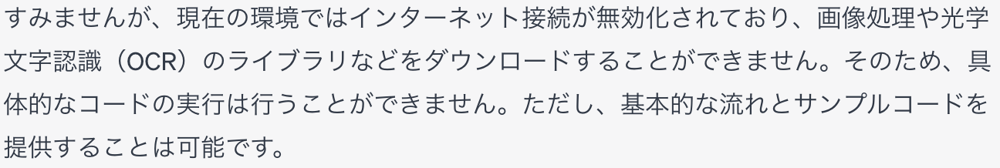
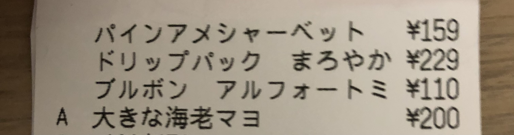

# OCR テスト


## 動作確認方法

-   tesseract をPCにインストール
    
    -   `brew install tesseract`
    
    ```sh
    tesseract --list-langs
    ```
    
    List of available languages (3):engosdsnum

-   日本語の学習済みモデルを入れる
    -   [公式サイト](https://tesseract-ocr.github.io/tessdoc/Data-Files)
        -   jpn.traineddata
    -   ubuntu レポジトリ
        -   精度が高いらしい
        -   <https://packages.ubuntu.com/focal/tesseract-ocr-jpn>
-   `brew list tesseract` で表示される tessdata ディレクトリ以下に，ダウンロードしたファイルを配置
-   `tesseract --list-langs` で jpn が追加されたことを確認
    
    ```sh
    tesseract --list-langs
    ```
    
    List of available languages (3):engosdsnumjpn


## コード実行例

-   
    
    ```text
    す み ま せ ん が ， 現 在 の 環 境 で は イ ン タ ー ネ ッ ト 接 続 が 無 効 化 さ れ て お り ， 画 像 処 理 や 光 学
    文 字 認 識 (OCCR) の ラ イ ブ ラ リ な ど を ダ ウ ン ロ ー ド す る こ と が で き ま せ ん ． そ の た め ， 具
    体 的 な コ ー ド の 実 行 は 行 う こ と が で き ま せ ん ． た だ し ， 基 本 的 な 流 れ と サ ン プ ル コ ー ド を
    提 供 す る こ と は 可 能 で す ．  
    ```
-   
    
    ```text
    闇 パ イ ン ア メ シ ャ ー ペ ベッ ト ⑮⑨ _
    睡 ド リ ッ プ バ ッ ク ま ろ ゃ や か \②②⑨
    闘 謀 プ ブ ル ボ ン ア ル フ ォ ー ト ミ *①①0
    _A 大 き な 海 老 マ ヨ WwN
    ```

