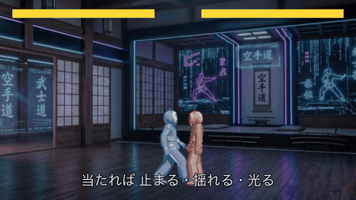

# ドパガキ仕様 2D格闘ゲーム

1試合30秒、負けても3秒で次が始まる、脳汁だけを抜き出した2D格闘ゲーム。
ボタンは3つ、コマンド入力なし、読み合いは上段＜下段＜投げ＜上段の3すくみだけ。

Godot 4.7 / GDScript。

## PV



音つきの全編（20秒）は **[Google Drive](https://drive.google.com/file/d/11HmDUJoIPFIW2EKvbky3mM6orIxV-_ab/view?usp=sharing)**（高画質）。
リポジトリ内にも圧縮版を置いてある（[docs/pv.mp4](docs/pv.mp4)）。
PV はゲーム内のシーンとして組んであり、`scenes/pv.tscn` を録画して作る（[docs/pv.md](docs/pv.md)）。

## 操作

| 入力 | 技 | 役割 |
| --- | --- | --- |
| ← → | 前後移動 | 間合いの調整 |
| ↓ | しゃがみ | 上段が当たらなくなる |
| Z | 上段パンチ | 25ダメージ。速い。下段に負ける |
| X | 下段キック | 30ダメージ。中速。投げに負ける |
| C | 投げ | 45ダメージ。遅いが大ダメージ。上段に負ける |
| F1 | 当たり判定の表示 | デバッグ用 |

## 動かす

```sh
/Applications/Godot.app/Contents/MacOS/Godot --path .
```

## テスト

試合のロジック（3すくみ、ダメージ計算、状態遷移、CPU、PV の台本）はシーンから切り離してあり、
[GUT](https://github.com/bitwes/Gut) でヘッドレスに実行できる。

```sh
./run_tests.sh
```

## 構成

シーンツリーは描画と入力収集だけを持ち、試合の進行は `RefCounted` の純粋な GDScript に閉じている。
`MatchCore` は固定タイムステップで、入力を辞書で受け取る。

| ファイル | 役割 |
| --- | --- |
| `scripts/moves.gd` | 技のフレームデータと定数。数値の調整はここに集約 |
| `scripts/combat_rules.gd` | 3すくみ、連続ヒット補正、逆転補正、効果音の音程 |
| `scripts/fighter_core.gd` | 1体分の状態機械 |
| `scripts/match_core.gd` | 試合の進行、当たり判定、勝敗 |
| `scripts/cpu_brain.gd` | CPU の行動（5段階） |
| `scripts/fighter_anim.gd` | 状態とフレームから再生するクリップと位置を決める |
| `scripts/fighter_3d_view.gd` | Mixamo のキャラを描く。輪郭線と足元の影 |
| `scripts/pv_script.gd` | PV の台本 |

## 素材

| 種類 | 出典 |
| --- | --- |
| キャラクター | [Tripo](https://www.tripo3d.ai/) で生成し [Mixamo](https://www.mixamo.com/) でリグとアニメーション |
| 効果音 | Kenney [Impact Sounds](https://kenney.nl/assets/impact-sounds) / [Interface Sounds](https://kenney.nl/assets/interface-sounds)（CC0） |
| BGM | OpenGameArt [Fast fight / battle music (looped)](https://opengameart.org/content/fast-fight-battle-music-looped)（CC0、Ville Nousiainen / XCVG） |
| 背景 | 画像生成 |

詳細は `assets/*/CREDITS.md`。
